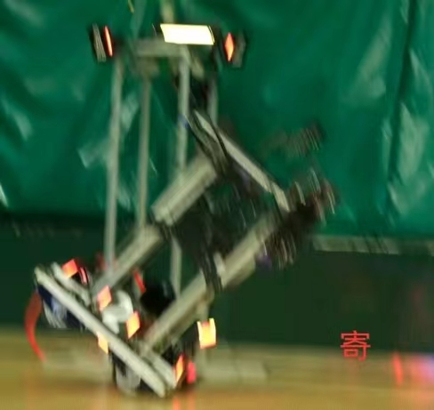

# 异常报告

已知可能出现的bug将会列在此处，并指明修复期限和任务执行者。

使用中遇到的bug和错误放在此处。参照下列格式：

## 标题用简短的一句话描述

### 出现问题的application/module/bsp

描述你的使用方法，应该贴上图片或代码块，以及硬件连线等

### 尝试解决的方案

你的尝试，以及猜测可能的错误

### 如何复现问题

问题能否稳定复现？描述复现方法等

### 紧急程度

这里用⭐表示。最大5颗⭐。

如果不修复，会有何种其他牵连情况发生？

---

不同的问题用 --- 分隔开

你还可以使用Stepsize插件在代码出现问题（可能出现问题）的地方添加issues并详尽描述。或在gitee上增加issues。

当然，最快的方法是在群里提问。

---

## AM3508空载时振荡

> 已修复此问题。

### 问题描述

将底盘的3508映射到AM3508时，电机没有输入时发生振荡（因此烧掉了一个MK20电调）

### 惨痛经历

因此烧掉了一个MK20电调

### 尝试解决的方案

遥控器发送给底盘的值很大，经过PID运算后得到的电流值很大，底盘电机带有负载不会发生振荡，AM3508空载时电机转动所需电流值很小，将遥控器接收值减小或调整PID参数可解决问题

### 如何复现问题

空载时，给电机一个很大的pid或pid_ref

### 紧急程度

⭐⭐⭐⭐⭐

---

## 使用CubeMX重新配置工程后编译失败

> 已修复此问题。

### 问题描述

使用CubeMX重新生成工程后，编译失败

### 尝试解决的方案

原因是CubeMX修改了Makefile文件——最后几行代码会被删掉，出现此问题请手动补充被删掉的代码

### 如何复现问题

使用CubeMX重新生成工程

### 紧急程度

⭐⭐⭐⭐⭐

---

## 两个前伸电机疯掉

> 已修复此问题，但还未找到可以兼容的办法。

### 问题描述

车身受到撞击等因素导致左右前伸距离有较大偏差时，两个前伸电机开始大幅度振荡

### 惨痛经历

比赛时疯车；
比赛时断车上掉一块重要玻纤板

### 尝试解决的方案

之前为保证前伸左右电机能同步运动无偏差而加入了同步调速算法，可能是参数过大或其他原因导致两电机偏差大时导致系统发散，现采取的解决办法是关闭同步调速功能。但目前未找到能够兼容同步调速和不发散的办法。

### 如何复现问题

开启同步调速后使前伸左右两电机有较大偏差

### 紧急程度

⭐⭐⭐⭐⭐

---

## AM3508电机不受控制

> 未解决

### 问题描述

当断掉上层版CAN1上挂载电机的电源或是CAN线，CAN2上挂载的两个AM3508电机开始不受控制并剧烈震荡。（在整车正常工作时也时不时会出现这个问题）

### 惨痛经历

比赛时疯车；
比赛时断车上掉一块重要玻纤板；
比赛最后一晚通宵换电机
在校运动会上疯车；

### 尝试解决的方案

将上层板复位后便可重新控制电机，但此问题仍会复现。目前采用的解决方法是将AM3508电机换成M3508，还未找到AM3508出现此问题的根本原因。

### 如何复现问题

断掉上层版CAN1一路上电机的电源或是CAN线，在整车正常工作时也时不时会出现这个问题

### 紧急程度

⭐⭐⭐⭐⭐

---

## 烧下层C板

> 未解决

### 问题描述

一次是在调PID时疯车烧掉一块下层板；一次是机械装完车，从406推到414后下层板便无法使用；
两次共同点都是烧下层板，原因可能是底盘四个电机运动时产生反生电动势（疑似）

### 惨痛经历

烧了两块C板（其中一块后面貌似又可以用了）

### 尝试解决的方案

换新的

### 如何复现问题

难

### 紧急程度

⭐⭐⭐⭐⭐

---

## 机械臂无法获得绝对角度

> 已解决

### 问题描述

电机上有减速箱，无法测得绝对角度

### 尝试解决的方案

目前方案为上电后使用堵转检测获得机械限位角度作为绝对角度，以此为基准计算相对角度；yaw轴无机械限位不适用这种方法；（此方法不推荐，不仅浪费时间，还损伤电机和机械结构）
每个轴上添加绝对值编码器；（对机械组成员不友好）
换双编电机；（推荐）

### 紧急程度

⭐⭐⭐⭐⭐

---

## 运动学逆解死点过多

> 未解决

### 问题描述

机械臂有许多位姿不可到达

### 尝试解决的方案

不使用解算

### 如何复现问题

打开运动学部分代码

### 紧急程度

⭐⭐⭐

---

## 底盘加速度过大会翻车

> 已解决

### 问题描述

抬升抬高后，快速启停，加速度过大导致翻车

### 尝试解决的方案

添加加速度限幅函数

### 如何复现问题

注释掉加速度函数

### 紧急程度

⭐⭐⭐

---

## 上层版进入调试机械臂会疯

> 已解决

### 问题描述

使用Ozone进入上层版调试，机械臂疯狂朝一个方向旋转，甚至越过了机械限位

### 惨痛经历

机械臂疯掉上甚至大Roll轴越过了机械限位

### 尝试解决的方案

未找到解决办法，但是后面再进调试又没出现过这种问题了

### 紧急程度

⭐⭐⭐

---

## 自定义控制器控制板只能读取五个轴

> 未解决

### 问题描述

使用F103控制板读取AS5600数据，PA/PB/PC/PD每种端口只能与一个AS5600进行软件I2C通信，使自定义控制器无法加入第六个轴系

### 紧急程度

⭐⭐⭐

---

## 部分AS5600上电后读取到一个非常大的值

> 未解决

### 问题描述

部分AS5600上电后读取到一个非常大的值，动一下立马恢复正常

### 紧急程度

⭐⭐⭐

---

## AS5600的I2C地址无法更改

> 已解决

### 问题描述

AS5600的I2C地址无法配置，所有AS5600地址都一样，导致多个AS5600无法挂载到同一条I2C总线上

### 尝试解决的方案

使用I2C扩展模块（PCF8575）；
使用其他通信方式；

### 紧急程度

⭐⭐⭐
